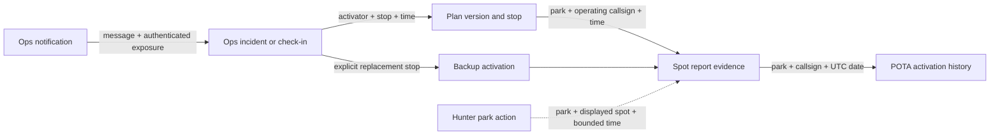

# Analytics and after-action reporting review

**September 10 implementation update:** essential collection and retention fixes
are described in [After-action collection and retention](after-action-collection.md).
This document preserves the original September 8 assessment and proposals.
Its October 14 reconciliation cutoff and descriptions of missing instrumentation
are historical; use the runbook and source for current behavior.

Reviewed September 8, 2026, starting at `c72c7b5b`. The final source check included concurrent commit `0475fbe2`, which centralizes POTA API transport without changing the collection findings below. This is an assessment and proposed collection design, not a record of implemented changes. Three independent reviews covered hunters/checklists, spot correlation, and activator/Ops Room activity; a fourth pass covered ingestion, reporting, production aggregates, and metadata design.

We already have the foundations for a useful after-action report. The biggest gains come from preserving event history and connecting existing structured records. Current feature analytics answer which tools were used; they cannot yet explain hunting progress, passive Ops Room readership, or the sequence from a schedule change to an observed activation.

The highest priorities before the event are: preserve detailed spot evidence, repair missing hunter events, and record time-bounded authenticated engagement. A richer report also needs full reconciliation of already-confirmed parks, consistent event-time context, and explicit definitions for what each observation proves.

## 1. What production is collecting today

The existing read-only `mise run analytics:report --json` completed at **2026-09-08 14:28:29 UTC**, using the default start of **2026-08-31 19:34:14 UTC** and excluding the known initial ingestion check.

| Recorded measure | Result | Interpretation |
| --- | ---: | --- |
| Anonymous browsers with a tracked interaction | 65 | Browser identifiers, not people or all visitors |
| Anonymous interactions | 386 | Sample-weighted feature events; different features have different deduplication rules |
| Browsers in the current hunter event set | 6 | An incomplete measure of checklist use |
| Import attempts / successes / failures | 11 / 8 / 3 | Attempts can repeat within one browser; no import-attempt ID links the stages |
| Checklist resumes | 18 | Imported checklists only under the current implementation |
| Manual-override events | 1 | First checkbox change per page, not number of parks worked |
| Activators recorded opening any tracked private feature | 8 | Existing activator IDs |
| Ops Room activators / bootstrap counts | 7 / 66 | Successful bootstrap loads, not visits or reading time |
| Ops Room posting activators / messages | 3 / 6 | Retained activator messages within the reporting window |
| My Plan activators / page-request counts | 8 / 41 | Page requests, not saves or completed activations |

A second read-only production query at **14:30:31 UTC** found **2,225 retained spot reports across 25 parks**, with source timestamps from September 3 through September 8. There were 41 tracked callsign/park history pairs, one active pair, and zero pairs with a current consecutive-failure count. This verifies that collection and history synchronization are producing data; it does not establish uninterrupted collection. Both event-specific evidence tables were empty, as expected before the configured September 10 UTC capture window.

Production GETs of `/` and `/activate-ri-2026/hunter/` returned 200 but contained neither `beacon.min.js` nor `data-cf-beacon`. Web Analytics deployment is therefore **not verified**. These two responses do not prove dashboard configuration for every visitor. Zone request analytics and the custom event dataset are separate products. See the [existing analytics runbook](../analytics.md).

## 2. Current data boundaries

| Source | Persisted now | Useful report questions | Main limitation |
| --- | --- | --- | --- |
| Public custom analytics | Scope, event name, HMAC browser key, fixed enum properties, schema version, ingestion timestamp, count | Feature adoption, filters, imports, CTA use, returning instrumented browsers | No session/action ID, park, stop, progress count, page category, client occurrence time, or displayed-data freshness |
| Authenticated feature usage | Activator ID, feature, first/last use, lifetime count | Which activators ever opened tracked features | Cannot reconstruct daily/hourly use or duration |
| Plans and activity log | Ownership, park, callsign context, planned UTC times, bands/modes/status; many previous/next change snapshots | Baseline coverage, approval/change/cancellation history | Current state is not the original plan; some audit rows describe unchanged saves |
| Ops Room messages and events | Actor, kind, park/stop, creation/edit/removal/resolution sequence | Contributors, incident categories, resolution timing | No durable exposure, acknowledgment, reply, assignment, or actual field-state history |
| Ops notification deliveries | Recipient, message, category, status, attempts, send timestamps | Notification volume, send failures and delays | Sent does not establish inbox delivery, reading, or action |
| Rolling POTA spot history | Report ID/time, park, activator/spotter callsigns, frequency/mode, comments, source, first/last observation, expiry/count | Spot timeline, source mix, bands/modes, self/re-spots, candidates for plan matching | Fourteen-day cleanup; reports are upserted rather than fully versioned |
| Event spot summaries | Event/park/UTC-date/callsign, first/last observation, latest report metadata and reference provenance | Which parks/callsigns were observed during the event | Collapses multiple reports; does not retain the complete radio timeline |
| POTA activation evidence | Park/callsign/QSO date, totals by CW/data/phone, qualification, first-seen/verification timestamps | Confirmed park coverage and reported activation totals | Current automatic polling stops revisiting a park after its first qualifying evidence |
| Worker/browser error logs | Structured failures, sanitized route/stack, request correlation; scheduled collection summaries | Reliability and incident diagnosis | Short retention; no durable event-wide reliability summary |

The anonymous browser key can associate public feature events within this event scope. Requests deliberately omit credentials and referrer, and the identifier is unrelated to authenticated activator IDs. There is no reliable hunter-person or hunter-to-activator identity join. Preserve that separation. [Client](../../src/lib/analytics/client.ts#L16), [event schema](../../src/lib/analytics/events.ts#L43), [storage mapping](../../src/worker/routes/analytics.ts#L81).

## 3. Findings that affect the report

### P0: Detailed spot evidence expires before reconciliation finishes

`pota_spot_observations` is cleaned by **source spot time older than 14 days**. The cleanup also removes old history-sync state. The surviving event table stores one summary per event/park/date/callsign. Event reports from September 10 begin becoming eligible for deletion on September 24, while activation reconciliation continues until October 14 UTC. Waiting for confirmed results before exporting loses the underlying spot timeline. [Cleanup](../../src/worker/pota-spot-history.ts#L4), [event summary schema](../../migrations/0011_activate_ri_pota_evidence.sql#L1), [reconciliation window](../../src/lib/activate-ri/pota-event.ts#L9).

**Recommendation:** archive the selected event's normalized report records before rolling cleanup can remove them. Keep source IDs, source times, observation/fetch times, provenance, and revisions of meaningful report changes. Use an event archive with a deliberate retention date, leaving the rolling UI cache independent. Export an initial snapshot immediately after the event, then reconcile later evidence into versioned reports. Backup-on-deploy is not an event archive schedule.

### P0: Checklist use is undercounted, and progress cannot be reconstructed

Starting a blank checklist emits no event. Resume collection requires `lastImportedAt`, excluding blank/manual checklists. Only the first manual checkbox change per page emits an event, with no direction, park, count, or action timestamp. `hunter_schedule_details_opened` is in the allowlist and report query but has no emitting call site. Per-park schedule links, requested-parks input, sharing, print, and scope changes have incomplete or absent coverage. [Checklist handlers](../../src/components/activate-ri/HunterChecklist.astro#L211), [resume](../../src/components/activate-ri/HunterChecklist.astro#L246), [manual override](../../src/components/activate-ri/HunterChecklist.astro#L438), [report cohort](../../scripts/analytics-report.ts#L16).

There is also a concrete rejected event: the hunter CTA sends `action: "hunter"`, which the server's action allowlist excludes. Local parser execution confirmed rejection; the existing instrumentation tests still pass. Those tests check source strings, not every rendered action/property combination. [CTA](../../src/components/activate-ri/VolunteerCtaBand.astro#L25), [allowlist](../../src/lib/analytics/events.ts#L6), [tests](../../src/components/activate-ri/analytics-instrumentation.test.ts#L1).

**Recommendation:** define a consistent checklist lifecycle: started, resumed, imported, progress changed, schedule opened, agenda prepared/shared, and print requested. Include blank/import/requested-agenda entry mode. Define “engaged hunter browser” using these meaningful actions, and include existing hunter schedule CTAs in the cohort. Do not interpret a checked box as a contemporaneous QSO: the checklist represents all-time Worked All RI progress, and its imports contain park references rather than contact timestamps.

Two additional import-quality issues were reproduced locally: a header-only CSV displays an empty-export error but emits `read_failed`; a valid import still emits `hunter_import_succeeded` when saving the checklist to localStorage fails. Split parsing outcome from persistence outcome. The parser already provides examined/recovered/skipped/matched counts, so clean imports, partial recovery, and zero RI matches can be distinguished with bounded categories. [Parser results](../../src/lib/activate-ri/hunter-checklist.ts#L23), [save failure](../../src/components/activate-ri/HunterChecklist.astro#L355), [error classifier](../../src/components/activate-ri/HunterChecklist.astro#L556).

### P0: Private-feature reporting loses the event-day timeline

One feature row accumulates first/last use and lifetime `use_count`. The report filters rows by `last_used_at >= since`, then sums the entire lifetime count. An activator with 20 pre-event opens and one weekend open contributes 21 opens to a weekend query. There is also no `--until`, so a later report cannot freeze an interval. [Rollup](../../src/worker/feature-usage.ts#L15), [query](../../scripts/analytics-report.ts#L336).

My Plan/account capture runs for authenticated **GET and HEAD** before fetching the asset. Thus its label “opens” includes requests that do not establish a rendered page. Ops Room is stronger—it records a successful bootstrap—but refreshes are still not distinct sessions. [Private page handling](../../src/worker/index.ts#L171), [Ops bootstrap](../../src/worker/routes/activate-ri-ops.ts#L58).

**Recommendation:** add daily or hourly feature-use facts immediately, with exact interval events if arbitrary windows matter. For engagement duration, add short foreground activity intervals or sessions separately. Count only eligible GETs after successful asset responses for request-based counters; use successful UI initialization for rendered-use metrics. Add explicit `[since, until)` bounds and label existing lifetime counts accurately.

### P1: Park confirmation is not a complete activation census

Automatic reconciliation excludes any park with qualifying evidence. This is appropriate for turning a coverage map green, but misses later operators, days, and QSO-count corrections at an already-confirmed park. Deep reconciliation can revisit all parks, but the report must explicitly require and verify it. [Selection query](../../src/worker/pota-event.ts#L491).

**Recommendation:** retain rapid polling for unconfirmed parks and add slower full-event reconciliation, including confirmed parks, with a completed full sweep before each published report. Record as-of time, parks attempted/succeeded, failures, and source version. State whether totals are provisional. Summed park activation QSO credits can double-count contacts credited to multiple parks; they are not automatically unique radio contacts.

The current upsert also retains earlier evidence that disappears from a later upstream response. A complete reconciliation needs fetch-generation tracking and explicit handling of missing/revised records; absence from a limited response must not imply deletion. Official logs have no submission deadline, so October 14 is this site's collection cutoff, not proof that all official results have arrived. [Evidence upsert](../../src/worker/pota-event.ts#L379), [official logging rules](https://docs.pota.app/docs/rules.html).

### P1: Ops Room readership is already detectable but remains local

The UI marks feed messages seen after roughly 60% visibility and one second of foreground dwell, excluding settings/edit dialogs. Seen IDs live only in the current browser's localStorage. The pinned announcement needs its own observation path. No server-side evidence currently distinguishes passive readers from visitors who never saw an important message. [Exposure logic](../../src/components/activate-ri/ActivatorOpsRoom.astro#L509), [local storage](../../src/components/activate-ri/ActivatorOpsRoom.astro#L526).

**Recommendation:** persist batched, deduplicated first exposure of announcements and operational messages, keyed by event/activator/message. Call this **exposure**, and add an explicit acknowledgment for instructions that need one. Track day-level unique readers independently of message count. This directly answers whether the room reached the activators who did not post.

### P1: Useful operational context is missing or overwritten

- Live and history normalization discard QRT reports, losing potential stop evidence. Keep QRT out of live listings but retain it as a separately typed report. The history endpoint also supplies a band field that current normalization drops; retain source band alongside derived band and normalizer version. [Normalizers](../../src/lib/pota/spots.ts#L108).
- The scheduled collector has snapshot `fetchedAt` and `stale`, but persisted observations do not retain those fields. A repeated cached observation is not a fresh upstream confirmation. Store snapshot identity, upstream fetch time, collection run, and stale/cache status. [Snapshot](../../src/worker/routes/pota.ts#L325), [scheduled persistence](../../src/worker/index.ts#L242).
- History targets are discovered from live or already-known callsign/park pairs. A short or completely missed activation may never become a target. Add bounded backfill candidates from published plans and official evidence, and archive event-dated reports even when retrieved after the live capture window. Historical availability is not guaranteed. [Target discovery](../../src/worker/pota-spot-history-sync.ts#L102), [historical persistence](../../src/worker/pota-spot-history-sync.ts#L189).
- Spot coverage joins by park. For planned-stop fulfillment, match park **and advertised operating callsign and time window**, preserving ambiguous cases. A different operator spotting the same park does not prove the scheduled stop happened. [Coverage join](../../src/worker/pota-spot-activity.ts#L147).
- Whole-plan saves emit stop-updated activity for existing editable stops even when unchanged. Compare previous/next meaningful fields before calculating schedule churn. Persist operation IDs and schedule revisions; batch state and its audit write where they are currently separate. [Plan save](../../src/worker/db.ts#L695), [single-stop history](../../src/worker/db.ts#L1044).
- Ops Room quick actions prepare messages; they do not record arrived/on-air/finished transitions or change the schedule. Optional one-tap check-ins would add direct self-reported field evidence. [Quick actions](../../src/components/activate-ri/ActivatorOpsRoom.astro#L398), [composer](../../src/components/activate-ri/OpsComposer.astro#L20).
- Ops socket attachments know connection ID and connected-at, but close handling is empty and only current connection counts are exposed. Preserve bounded connection/foreground intervals to report historical concurrency and reconnect problems. [Durable Object](../../src/worker/durable-objects/activate-ri-ops-room.ts#L18).

The public volunteer funnel also ends at submit-attempt/client-validation telemetry. The browser knows success, server rejection, and network failure but emits none of those outcomes. Add coarse result categories to explain drop-off; derive actual submissions, approvals, and stops from D1. Do not divide anonymous starters by authenticated activators and label that a person-level conversion rate. [Volunteer response handling](../../src/components/activate-ri/VolunteerForm.astro#L150).

### P1: Report and collection health need explicit measurement

The anonymous sender ignores HTTP status, and there is no retry queue or event ID. Failures must remain nonblocking, but currently a 400, 429, or 503 can silently erase an interaction. The rate limit is 60 requests/minute per network IP in the checked-in production config; adding heartbeat-style events would increase contention among people on shared Wi-Fi. Keep low-frequency semantic events, batch where useful, and use bounded retry only with idempotency. [Sender](../../src/lib/analytics/client.ts#L16), [route](../../src/worker/routes/analytics.ts#L23), [configuration](../../wrangler.jsonc#L82).

Validate event names with own-property membership. A local parser probe accepted the undeclared inherited name `toString`, because validation uses JavaScript's `in` operator. This weakens the stated allowlist. Replace it with an own-key check and exercise rendered event payloads through the parser. [Validation](../../src/lib/analytics/events.ts#L85).

Persist daily collection success/failure counts, fresh-source coverage minutes, missing-run intervals, analytics response classes, and coarse client-error counts. Browser error reporting already captures useful sanitized details but caps/deduplicates reports and only writes logs, so it is a diagnostic sample rather than an exact affected-user count. [Client reporter](../../src/lib/client-error-reporting.ts#L35), [server logger](../../src/worker/routes/client-errors.ts#L57).

The newly centralized [POTA transport](../../src/worker/pota-api.ts#L13) provides a common point for upstream request timing and response outcomes. Keep all added backfill/reconciliation requests on that transport; per-run coverage and ingestion outcomes still belong with the collectors.

Workers Logs retain 3 days on Free or 7 on Paid; Analytics Engine retains three months and can sample records. It cannot guarantee retrieval of an individual event or an exact sequence. Preserve durable domain outcomes in D1 and use Analytics Engine for aggregate behavior. Export aggregate analytics before the runbook's November 28 deadline. [Log retention](https://developers.cloudflare.com/workers/observability/logs/workers-logs/), [Analytics Engine retention](https://developers.cloudflare.com/analytics/analytics-engine/limits/), [sampling limits](https://developers.cloudflare.com/analytics/analytics-engine/sampling/).

## 4. Metadata available at the moment of an action

The following is a proposed extension, not metadata we currently collect in every event.

| Layer | Available context | Recommended capture | What it cannot establish |
| --- | --- | --- | --- |
| Browser action | Control, page, selected filters, entry path, current UI state | Allowlisted page/feature/action/destination, event phase, optional short session ID and action ID | Visitor identity, actual radio activity |
| Checklist | Entry mode, imported/manual counts, worked/remaining counts, parser recovery counts, selected agenda size | Count snapshots, direction of change, import quality/outcome, baseline-vs-update marker | Contact date, counterpart, band/mode, official credit from a manual tick |
| Selected park/stop | Catalog park reference, schedule stop ID, shown bands/modes/time | Validated entity reference where the reporting question needs it; schedule version | Exact operator location or fulfillment of a stop |
| Data presentation | Fetch/generated timestamp, stale/error state, live spot count, target visible in viewport | Freshness bucket, empty/error distinction, exposure or action on displayed item | Reading/comprehension; server delivery alone is not exposure |
| Browser environment | Foreground visibility, screen-size class, language/time zone, observed offline/retry state | Coarse device/layout and connection-state buckets when useful | Exact device model or reliable network quality from one browser flag |
| Cloudflare request | Server receipt time, country/region, network/edge context; optional connection statistics | Server time; coarse geography only if it answers a report question | Physical position, park presence, hunter callsign or demographics |
| Authenticated server action | Authorized user/activator, event membership, stop ownership, result, server timestamp | Existing opaque IDs, outcome, operation/entity ID, before/after structured facts | Anonymous browser identity without an explicit identity-link feature |
| Spot collection | Upstream report and ID, source time, fetch time, collection time, source/provenance, spotter/activator, frequency/mode | Preserve normalized reports and meaningful revisions, source band, QRT kind, snapshot freshness | Verified QSOs, actual first/last transmission, absence of unspotted operators |
| POTA history | Reported activation date and aggregate QSOs by mode family | First discovered/last verified/as-of, qualification and reconciliation completeness | Individual hunter contacts, precise on-air time, unique cross-park QSO count |

Cloudflare exposes geographic and network fields on incoming requests, with availability varying by request. Geographic fields describe the request's network origin. Browser GPS would require a user-granted location feature; existing map GPS functionality is not an analytics location feed. No such permission is necessary for the proposed reporting design. [Request metadata](https://developers.cloudflare.com/workers/runtime-apis/request/), [local location session](../../src/lib/location/session.ts#L46).

Most metadata should come from structured UI/domain state, not raw URLs, search text, filenames, chat bodies, or uploaded CSV rows. The current custom schema is enum-only; bounded numeric counts and validated park/stop references require a versioned schema change. Keep GPC/DNT behavior and private-page separation. Adding park-level hunter telemetry changes the current disclosed metadata contract and its regression tests, so update the disclosure and allowlist together.

Start with anonymous count-only progress and feature usage. If per-park demand or tick-to-spot analysis is selected, add narrowly defined park-level actions; do not upload the hunter's complete checklist or associate it with a callsign. An optional event-specific contact log or explicit “worked this station now” action would be a separate feature with different semantics.

## 5. A concrete event and storage design

Use a small shared envelope: `schema_version`, `event_scope`, `event_name`, `record_id`, `occurred_at`, `received_at`, `producer`, `app_version`, and validated page/phase context. Server actions receive a server-generated time and trusted actor ID; browser time is client-reported and must be bounded/flagged for clock skew. Offline actions retain original occurrence time and gain a separate receipt time. Retries reuse the record ID. Mark test/rehearsal sources separately so future reports do not depend on excluding one hard-coded timestamp.

Add fields per action rather than one unbounded metadata object:

| Proposed event/fact | Specific fields | Storage/use |
| --- | --- | --- |
| `hunter_checklist_started/resumed` | Entry mode, worked/remaining counts, baseline/update, storage available | Anonymous Analytics Engine adoption/cohorts |
| `hunter_import_result` | Attempt ID, method, coarse result/error, row/count quality buckets | Import reliability; content remains local |
| `hunter_progress_changed` | Checked/unchecked, resulting counts, optional validated park and current-vs-historical intent | Self-reported checklist progress; per-park extension only if selected |
| `hunter_agenda_action` | Build/open/share/print-request, requested/remaining scope, park-count bucket, result | Agenda adoption and handoffs; print request is not completed printing |
| `live_spot_action` | Surface, action, source spot ID, park, displayed snapshot/freshness | Live-dashboard usefulness; does not prove a QSO |
| Authenticated feature interval | Activator, feature, UTC bucket or session bounds, visible-room seconds, entry source | D1 time-bounded exposure; active engagement additionally needs an inactivity definition |
| Message exposure/acknowledgment | Activator, message ID, channel, first exposure/ack time | D1 unique reach and acknowledgment latency |
| Field check-in | Stop, actor, operating callsign snapshot, reported state/time, optional ETA/band/mode | D1 direct self-reported operational timeline |
| Incident transition | Message/incident, reason, actor, acknowledged/assigned/resolved state, replacement stop | D1 measurable backup and problem response |
| Collection run | Source, scheduled/started/finished times, status, freshness, new/updated/ignored report counts, errors | Durable completeness and reliability denominator |
| Spot archive revision | Source report ID, normalized fields, source/fetch/ingestion time, revision/provenance | D1 initially or append-only object archive for exact evidence |

Do not duplicate existing ops messages or plan mutations into a competing event store. Extend their structured history and derive reporting views. For critical outcomes, commit the state transition and reporting fact together; optional aggregate analytics can stay best effort. Preserve message editing/removal semantics: ops replay uses current message content and deliberately does not retain prior body text. [Ops events](../../src/worker/ops-db.ts#L254), [redaction](../../src/worker/ops-db.ts#L709).

For low-volume event records, extending D1 and adding an export task is sufficient. An object archive can hold periodic immutable snapshots if volume or retention warrants it. Avoid moving every existing counter to a new system. Anonymous behavior remains sampled/estimated; exact opt-in outcome tracking, if added, needs an explicitly durable path.

## 6. Correlations that would make the report useful

Use a dedicated **match record** with candidate stop IDs, method/version, evidence IDs, time tolerance, and `exact`, `probable`, `ambiguous`, or `unmatched` classification. Prefer exact advertised callsign; any portable/club alias matching must be explicit and preserve ambiguity. Retain the plan as it existed when evidence was observed, not just the final edited row. Preserve primary-versus-declared multi-park provenance so one report is not mistaken for several independent reports.

Keep three clocks distinct: source radio/report time, our upstream fetch/first-observation time, and user action/receipt time. A checklist tick after a spot is a temporal association. It does not establish the hunter saw that spot, worked that operator, or used that band. Linking an action to the specific displayed report is stronger exposure evidence, but still not proof of contact.

Official POTA guidance permits spotting without having worked the activator. Consequently a graph of spotter-to-activator edges is a **spotting network**, not a contact network. Similarly, public spot coordinates may describe the park: the checked RI upstream example matched the installed park catalog. Do not interpret these as live operator GPS. [Official spotting guidance](https://docs.pota.app/docs/rules.html).

## 7. Proposed after-action report

| View | Measures and decisions it supports | Evidence needed |
| --- | --- | --- |
| Event coverage | Catalog parks → planned → observed → qualifying evidence; time to first observation/confirmation | Existing records plus frozen catalog/plan baseline and complete reconciliation |
| Park-by-time heatmap | Planned windows, observed spot windows, reported field states, gaps, bands/modes | Archived spots and plan versions; label observed windows carefully |
| Schedule reliability | Matching evidence by stop, unmatched/ambiguous stops, start deviation, late cancellations, meaningful revision count | Versioned plans and explicit matching; first spot is only a start proxy |
| Hunter adoption | Started/imported/manual/agenda cohorts; returning engaged browsers; feature combinations | Repaired lifecycle instrumentation and a defined cohort |
| Hunter progress | Baseline versus later worked/remaining counts, self-reported additions, progress distribution | New count snapshots; no claim that all gains happened during the event |
| Demand versus opportunity | Most-requested parks against planned and observed opportunities; underserved mode/time combinations | Optional park-level demand actions, source context, sufficient anonymous cohort size |
| Agenda usefulness | Requested agenda → schedule opened → shared/print requested; empty agendas and no-match cases | Semantic actions and counts, not URL contents |
| Ops participation | Eligible activators → rules accepted → opened → exposed → contributed; daily readers versus posters | Existing membership plus time-bounded use/exposure; stages are not necessarily linear |
| Coordination effectiveness | Access/backup/delay incidents; acknowledgment, assignment and resolution times; unresolved minutes | Structured incident links/transitions; explicit replacement stop |
| Notification usefulness | Send accepted/failed → message-target arrival → exposure → acknowledgment/action | Existing delivery rows plus attributed UI actions |
| Community participation | Distinct operating callsigns, roving park sequences, mode diversity, self-spots versus third-party reports | Archived report and activation evidence; not unique people or verified contact edges |
| Reliability | Fresh-feed availability, upstream gaps, UI empty/error states, send retry recovery, analytics rejection counts | Collection-run history and durable aggregate error metrics |
| Evidence completeness | Coverage of collection windows, reconciliation completion, unmatched sources, sample/opt-out limits | Explicit quality metadata attached to every report version |

Compare Ops Room use with schedule reliability and observed activity as associations. Highly active operators may both use the room more and activate more parks; the data alone cannot establish that the room caused their success.

Access and backup messages currently support resolve/reopen; running-late messages do not. Delay-resolution measurements require an explicit new lifecycle rather than treating later chat as resolution. [Resolution validation](../../src/worker/ops-db.ts#L506).

For email attribution, current message fragments are a useful entry hint but are not unique proof that a link came from email. Use an allowlisted entry-source marker if needed. Also fix target retrieval: bootstrap returns only the newest 50 surviving messages, and current deep-link handling scrolls only when the message is already loaded. Older notification links need authenticated fetch-by-message-ID. [Bootstrap](../../src/worker/ops-db.ts#L121), [deep-link handling](../../src/components/activate-ri/ActivatorOpsRoom.astro#L207).

## 8. Further opportunities

These are useful extensions after the essentials, with their additional evidence requirements made explicit.

| Opportunity | Useful question | Additional input required |
| --- | --- | --- |
| Promotion and entry channels | Did club newsletters, shared agendas, or printed QR codes bring engaged users? | Allowlisted campaign/source codes and meaningful landing actions; avoid storing full referrers or arbitrary URL parameters |
| Search and filter dead ends | Which parks, time windows, or band/mode choices produced no usable opportunities? | Selected structured constraints, result-count/freshness buckets; no raw search text needed |
| Single-operator coverage risk | Which parks depended on one station, and how often did backup preserve coverage? | Frozen plan snapshots, station identity rules, explicit backup links, later evidence |
| Roving and handoffs | Where did park transitions or simultaneous multi-park activations improve opportunity? | Reported/observed operating intervals and park geometry; do not infer travel paths from browser locations |
| Operator debrief | What actually caused missed plans: access, weather, equipment, timing, or connectivity? | Short optional structured post-event survey linked to a stop; telemetry alone cannot explain intent or cause |
| Hunter debrief | Which tools were useful, and what stopped hunters from making contacts? | Optional short survey; distinguish respondents from all hunters |
| Environmental context | Did observed activity patterns coincide with weather or propagation conditions? | Dated external observations joined by time/park, plus uncertainty and comparison periods; correlation cannot assign cause |
| Verified contact network | Which stations connected hunters, parks, and modes? | A separately authorized participant-log workflow with QSO timestamps and counterpart IDs; public spot/history aggregates are insufficient |
| Next-year comparisons | Did improved planning reduce gaps or make tools more useful? | Frozen metric definitions, collection versions, event windows, and comparable denominators; account for changing instrumentation |

## 9. Delivery order and acceptance criteria

| Priority/package | Concrete scope | Completion evidence |
| --- | --- | --- |
| Before event: preservation | Event spot archive, snapshot freshness, collection-run summaries, scheduled aggregate exports with explicit retention | An aged event report survives rolling cleanup; zero new reports is distinguishable from failed collection; exported records reconcile with source counts |
| Before event: collection correctness | Fix hunter action allowlist; blank/manual resume; real schedule/agenda actions; own-key validation; explicit cohort | Browser journeys produce accepted expected payloads; repeat/manual/import paths behave consistently; privacy opt-outs still suppress anonymous events |
| Before event: time-bounded ops adoption | Daily/hourly authenticated feature facts; GET/HEAD semantics; report `--until` | Pre-event opens cannot inflate weekend totals; repeated tabs/refreshes do not inflate unique activators |
| Before event if readership is required | Announcement exposure, foreground use, notification target lookup, delivery-to-action attribution | Foreground exposure recorded once per actor/message; pinned and older linked messages work; reconnect tests preserve deduplication |
| Next: better operational evidence | Optional check-ins, incident acknowledgment/assignment/replacement links, normalized plan revisions | Rehearsed delay/backup scenario produces a coherent timeline without changing planned times implicitly |
| Before reporting: trustworthy joins | Complete reconciliation including confirmed parks; matching rules and evidence confidence; consistent time windows | A second operator at an already-confirmed park appears; ambiguous overlapping stops remain ambiguous; multi-park credits are not labeled unique QSOs |

At the current September 8 baseline, the soft capture period starts **September 10 00:00 UTC (September 9, 8 p.m. EDT)**; main event dates are September 11–13 UTC. The source-date filter ends September 13 UTC, capture has a 15-minute final grace period, and history reconciliation stops October 14 UTC. Record these exact boundaries in every report, and separate soft-start, main-event, and post-event periods. This review does not change them. [Window implementation](../../src/lib/activate-ri/pota-event.ts#L191), [event configuration](../../src/data/activate-ri-2026/event.ts#L9).

Produce a provisional report and archive on September 14, with subsequent dated reconciliation editions. Preserve logs/health summaries during the event rather than depending on their short retention. Validate exports before allowing their source data to expire. Daily unique-browser totals are not additive: period-wide unique counts need their own interval query before retention removes the inputs.

Any desired new behavioral observation—checklist progress, message exposure, foreground use, or check-in—must be collected during the event. Only the report/query implementation can safely wait. The prioritization above reflects implementation scope, not an ability to recover missing observations later.

## 10. Verification and limits of this review

- Production checks were read-only aggregate analytics/D1 queries and public HTML GETs. No production checklist data, posts, spots, emails, or activations were submitted by this review.
- Shared analytics checks: **5 test files / 23 tests passed**, covering client collection, ingestion, report generation, authenticated rollups, and existing instrumentation contracts.
- Activator/Ops checks: **4 test files / 33 tests passed**, covering ops behavior, notification delivery, plan cancellation, and UI contracts with isolated SQLite.
- Hunter browser checks used a temporary local Astro server, synthetic CSVs, mocked public schedule data, and intercepted telemetry. Blank start and manual-checklist reload emitted nothing; two checkbox changes emitted one override event; drop import emitted attempt/success; imported reload emitted resume; per-park schedule navigation, remaining scope, sharing, and print emitted nothing. Empty-export misclassification and storage-failure success were also reproduced. GPC correctly suppressed collection. The browser and server were closed afterward.
- The spot review inspected source and made read-only GETs against official live/history endpoints to inspect current response fields. It did not run the spot test suite or submit any upstream reports.
- Existing passing tests establish the current tested behavior. They do not validate the proposed schema, retention policy, or collection changes.
- Collection was observed working at the stated snapshot time. Continuous uptime, full historical completeness, Web Analytics configuration, and individual participant identity were not established.

The recommended first implementation is deliberately small: preserve evidence, fix undercounting, retain daily engagement, and make the report's time bounds accurate. That provides a defensible event report while leaving richer park-level hunter attribution and optional field-state workflows as explicit follow-on design choices.
