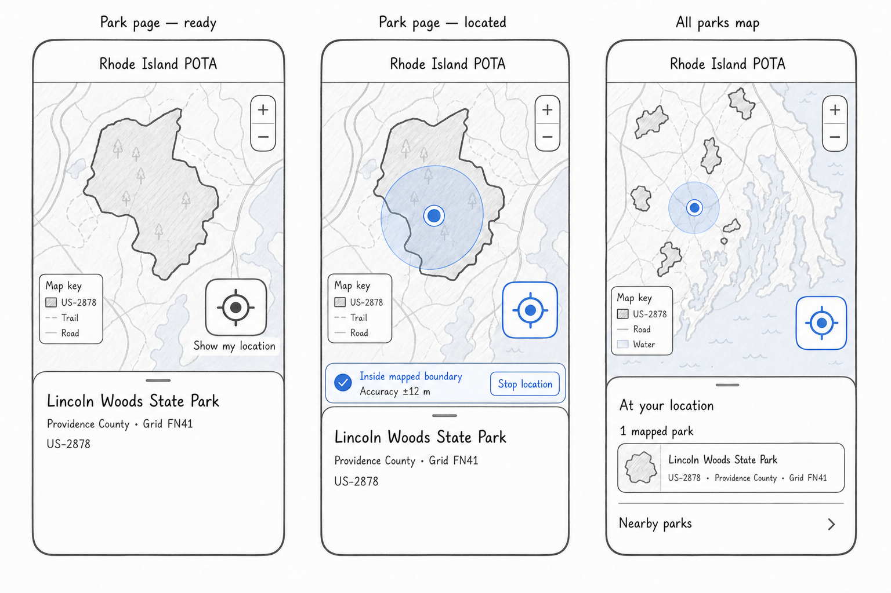

# Live Interactive Park Location

**Status:** Proposed design; no implementation included  
**Date:** 2026-09-01  
**Primary surface:** Individual park field guides  
**Secondary surface:** Future all-parks map

## Recommendation

Add an explicit **Show my location** target control to the map on every
individual park page. The control should ask for location only after a tap,
then show:

- a standard blue location dot;
- a translucent accuracy circle using the browser-reported accuracy radius;
- a concise result: **Inside mapped boundary**, **Outside mapped boundary**,
  or **Near mapped boundary — location is uncertain**; and
- the current accuracy and a visible way to stop location updates.

Build this on the individual park page first. It already loads one reviewed
geometry, gives the result an unambiguous reference, and has room for the
necessary source and rules caveats. Reuse the same location session and
classification logic when `/parks/` becomes a statewide map. On that surface,
the result becomes a discovery sheet listing mapped parks at or near the
current location.

The product must say **mapped boundary** or **mapped activation zone**, never
claim that a GPS fix proves a valid POTA activation. The local geometry is a
community-maintained, time-stamped planning aid. Official POTA resources,
managing agencies, posted signs, access rules, and station-placement rules
remain authoritative.

The complete interaction is client-side. RI POTA should not upload, log,
persist, or add location coordinates to URLs or analytics.

## Why This Belongs in Both Places

### Individual park page: the decision surface

This is the best first release and the clearest place to answer the field
question: “Does my reported position appear to be inside this mapped area?”

- The map already emphasizes one park geometry.
- A boundary, activation zone, or point-only limitation can be named directly.
- Same-geometry and possible multi-reference relationships are already known.
- The location code and Turf dependency can stay out of pages with no map.
- Only the current park and its related geometries need classification.

### All-parks map: the discovery surface

When the top of `/parks/` becomes a statewide map, use the same target control
to answer: “Which mapped parks am I in or near?”

After the first location fix, open a mobile bottom sheet with:

1. **At your location** — all definite or edge-uncertain matches;
2. **Nearby parks** — a short, distance-sorted list; and
3. links to the individual field guides for the full map, geometry semantics,
   source, and caveat.

Do not make the all-parks map the only entry point. Operators commonly arrive
from a saved park URL, search result, event schedule, or POTA page.

## Current Foundation

The current site is well positioned for this feature:

- It is a static-first Astro site using Leaflet 1.9.4.
- `ParkDetailMap.astro` already renders one park plus related geometries.
- `ReferenceMap.astro` already renders the statewide set.
- `@ripota/parks` v3 provides EPSG:4326 GeoJSON display geometry, which uses
  the same WGS84 coordinate system as browser geolocation.
- The catalog contains 59 boundaries, one derived trail activation zone, and
  one deliberate point-only fallback.

The geometry package deliberately warns that its data are not legal boundaries,
access determinations, navigation data, surveys, or official activation
validity decisions. That warning shapes the result language and uncertainty
model in this design.

The full statewide display aggregate is about 4.9 MB uncompressed and about
750 KB with gzip in the current package. The individual park page therefore
remains the lower-cost MVP. The future statewide map should serve the aggregate
as a cacheable static GeoJSON resource rather than embedding the larger catalog
payload into HTML.

## Prior Art: POTAMAP.US

[POTAMAP.US](https://potamap.us/) currently exposes three stacked map controls,
including a `🎯` control titled **Zoom to your position**. Its public source
shows that:

- an OpenLayers geolocation object tracks the device with high accuracy;
- the map renders a blue position point and an accuracy geometry; and
- the target control recenters the map on the most recent position.

Relevant source:

- [position and accuracy layer](https://github.com/cwhelchel/potamap.ol/blob/main/getGeolocationLayer.js)
- [target/recenter control](https://github.com/cwhelchel/potamap.ol/blob/main/controls/ZoomToPosControl.js)

That is a useful, recognizable interaction model. RI POTA should retain the
target metaphor and blue-dot convention, while improving four things for this
specific use case:

1. do not begin location tracking before the user asks;
2. give the target control an accessible label, not only an emoji and tooltip;
3. interpret the accuracy circle relative to the mapped edge; and
4. state the result in text rather than asking the user to judge overlapping
   shapes visually.

## Park-Page Interaction

### Placement

- Keep the target in the same bottom-right Leaflet control column as zoom,
  positioned above the zoom buttons.
- Use a minimum 44-by-44 CSS-pixel touch target.
- Keep the existing geometry key at the top-right.
- On mobile, show the result in a compact tray across the bottom of the map,
  above attribution and clear of the control column.
- On desktop, the same tray can be narrower and left-aligned in unobstructed
  map space.
- Preserve **Recenter map** as the way to return to the park geometry.

Use the target/bullseye graphic as the visible icon if desired, but give the
button the accessible name **Show my location**. Emoji rendering varies by
platform and must not be the only semantic label.

### First tap

1. Change the control to a locating state.
2. Announce **Finding your location…** through a polite live region.
3. Ask the browser for geolocation permission.
4. On the first usable fix, draw the accuracy circle and blue dot.
5. Center on the location at a useful field zoom while leaving **Recenter map**
   available.
6. Classify the location and open the status tray.

Do not ask for permission on page load. The tap provides context immediately
before the browser prompt and avoids surprising a visitor who only wanted to
read the field guide.

### While active

- Continue updating the dot, accuracy circle, and result while the page is
  visible.
- Do not force the map camera to follow every update. If the user pans, the dot
  can keep moving while the camera stays put.
- A later target tap recenters on the latest fix.
- Keep a visible **Stop location** action while updates are active.
- Stop the watch when the user stops it, leaves the page, or the document is
  hidden. A return to the page should require another deliberate tap to resume.

This makes “live” useful without letting the map fight the user or keeping GPS
active invisibly in the background.

## Result Model

The browser reports an accuracy radius in meters. The current Geolocation
specification defines that value at a 95% confidence level. The status should
use both the point and that radius rather than treating a single coordinate as
perfect.

For a polygon or multipolygon, calculate signed distance `d` from the reported
point to the nearest polygon edge, where negative means inside, positive means
outside, and zero is on the edge. Let `a` be the reported accuracy radius.

| Condition    | Result                      | Meaning                                                                  |
| ------------ | --------------------------- | ------------------------------------------------------------------------ |
| `d <= -a`    | **Inside mapped boundary**  | The full reported accuracy circle fits inside the mapped geometry.       |
| `d >= a`     | **Outside mapped boundary** | The full reported accuracy circle fits outside the mapped geometry.      |
| `-a < d < a` | **Near mapped boundary**    | The accuracy circle crosses the mapped edge, so the result is uncertain. |

Always show `Accuracy ±N m`. The circle on the map and the text result must use
the same radius.

This model is intentionally conservative. It avoids a green “inside” result
when the center dot is barely over a line but the location uncertainty spans
both sides.

### Geometry-specific language

| Geometry kind   | Allowed result language                        | Additional behavior                                                                                     |
| --------------- | ---------------------------------------------- | ------------------------------------------------------------------------------------------------------- |
| Boundary        | Inside/outside/near **mapped boundary**        | Normal signed-distance classification.                                                                  |
| Activation zone | Inside/outside/near **mapped activation zone** | Explain that the zone is derived from the reviewed trail rule and route snapshot.                       |
| Point only      | **No mapped boundary available**               | Show the blue dot and optional distance to the reference coordinate, but never classify inside/outside. |

Holes and disconnected multipolygon components must be honored. A point in a
polygon hole is outside. A point inside any component of a multipolygon is
inside that mapped geometry.

### Related and overlapping references

On a page with related geometries, classify each visible reference separately.
If the location is definitely inside more than one mapped geometry, the tray
may say **Inside 2 mapped areas** and list both references. Keep the existing
possible multi-reference caution: a geometry overlap is not by itself proof
that an activation can be claimed for every reference.

## State and Copy Matrix

| State                | Primary copy                                  | Secondary action                                 |
| -------------------- | --------------------------------------------- | ------------------------------------------------ |
| Idle                 | **Show my location**                          | None                                             |
| Requesting           | **Finding your location…**                    | Cancel/stop if a watch has started               |
| Definite inside      | **Inside mapped boundary**                    | Recenter on me · Stop location                   |
| Definite outside     | **Outside mapped boundary**                   | Recenter on me · Show park · Stop location       |
| Edge uncertain       | **Near mapped boundary**                      | “Your ±N m accuracy crosses the mapped edge.”    |
| Point-only park      | **No mapped boundary available**              | “This park has only a reference coordinate.”     |
| Permission denied    | **Location access is off**                    | “Enable it in browser settings, then try again.” |
| Position unavailable | **Your device could not get a location**      | Try again                                        |
| Timeout              | **Location took too long**                    | “Move to an open area or try again.”             |
| Unsupported/insecure | **Location is not available in this browser** | Keep normal map controls                         |

Do not use success/error color alone. Pair every state with text and a distinct
icon or shape. The blue dot always means the reported device position; it does
not change color to imply activation validity.

## Future All-Parks Map Behavior

The target stays in the same control position and uses the same lifecycle.
After the first fix:

- center at a neighborhood-scale zoom rather than the statewide fit;
- classify the location against all polygonal display geometries;
- highlight definite and edge-uncertain matches;
- open a bottom sheet instead of a park-specific status tray; and
- list definite matches before uncertain matches, then nearby parks.

If no polygon matches, say **No mapped RI park contains this location** and
show nearby field-guide links. A point-only record can appear under nearby
parks with a **Point only** badge, but cannot appear as an inside match.

For an overlap, list each matching reference separately. Do not collapse them
into one result even if they share the same display geometry.

## Client Architecture

No Worker route, D1 table, account feature, or server session is required.

### Shared location session

Create one small client module, independent of Leaflet, that owns:

- idle/requesting/active/error/stopped state;
- `navigator.geolocation.watchPosition()` and `clearWatch()`;
- high-accuracy options and a bounded timeout;
- page-visibility and teardown behavior; and
- normalized, testable position updates.

Using the native API directly keeps the session reusable across
`ParkDetailMap` and `ReferenceMap`. Leaflet remains responsible for rendering,
camera movement, and controls.

Suggested initial options:

- `enableHighAccuracy: true`;
- `maximumAge: 5_000` milliseconds; and
- `timeout: 12_000` milliseconds.

These values should be validated on iPhone and Android hardware. High accuracy
can take longer and consume more power, which is another reason to make the
session explicit and short-lived.

### Geometry classification

Use the modular
[`@turf/point-to-polygon-distance`](https://turfjs.org/docs/api/pointToPolygonDistance)
package. It returns a signed distance for polygons and multipolygons, including
holes, which maps directly to the conservative accuracy model above. Avoid the
larger `@turf/turf` bundle.

Extract polygon and multipolygon features from each GeoJSON feature collection.
Point features are display-only and must not enter containment classification.
The v3 catalog currently provides one park-level display feature per reference,
but the classifier should not rely on that remaining true forever.

### Leaflet integration

Each map instance adds:

- a custom target control;
- one non-interactive location layer group;
- `L.circle` for the meter-based accuracy radius;
- `L.circleMarker` for the fixed-size blue dot; and
- a status region outside the Leaflet canvas for accessible text.

Leaflet also exposes `map.locate`, `locationfound`, `locationerror`, and
`stopLocate`, but the shared native session is preferable because containment,
privacy lifecycle, and state transitions should not be coupled to a map
instance.

### Suggested code boundaries for a later implementation

- `src/lib/location/session.ts` — geolocation lifecycle only;
- `src/lib/location/classify.ts` — pure geometry/accuracy classification;
- `src/lib/location/copy.ts` — geometry-aware status labels;
- one shared Leaflet location-control helper; and
- thin adapters in `ParkDetailMap.astro` and `ReferenceMap.astro`.

These names are illustrative design boundaries, not files created by this
proposal.

## Privacy and Security

- Request location only after the target control is tapped.
- Use location only in memory for the open page.
- Do not write coordinates, accuracy, containment status, or movement to D1,
  cookies, local storage, session storage, logs, query strings, error reports,
  or analytics.
- If interaction analytics are useful, record only coarse control events such
  as `location_requested`, `location_started`, `location_stopped`, or a generic
  error category. Do not attach coordinates, accuracy, or derived park matches.
- Clear the watch promptly and visibly.
- Keep the feature top-level and same-origin. If a Permissions-Policy header is
  added, allow only `geolocation=(self)`; do not grant it to cross-origin
  frames.
- Production already uses HTTPS. Geolocation also works on `localhost`, but a
  phone opening a developer machine by LAN IP over plain HTTP will not be a
  secure context; use a secure preview for device testing.

RI POTA itself should not retransmit the coordinates. The privacy note should
also be precise: the browser/OS supplies location, while normal map-tile
requests still go to the configured tile provider as the view moves.

Recommended inline disclosure before or beside the first-use control:

> Your browser supplies your location to this page. RI POTA uses it only on
> this device to draw the blue dot and compare it with the mapped area. It is
> not saved or sent to an RI POTA account or database.

## Accessibility

- Give the target control a visible focus style and the accessible name
  **Show my location** or **Recenter on my location**, depending on state.
- Use a polite live region for requesting, result, and error messages.
- Keep the textual result in normal DOM outside the Leaflet canvas.
- Ensure every action is keyboard operable.
- Use at least 44-by-44 CSS-pixel touch targets.
- Never require the user to distinguish only by color, boundary fill, or the
  relative position of the dot.
- Keep zoom, location, attribution, geometry key, and result tray from
  overlapping at 320 CSS pixels wide and at 200% text zoom.

## Testing and Acceptance

### Pure unit tests

Use synthetic GeoJSON fixtures to cover:

- definitely inside, definitely outside, and accuracy-crosses-edge cases;
- exactly on the boundary;
- polygon holes;
- disconnected multipolygons;
- activation-zone copy;
- point-only behavior;
- multiple related references; and
- invalid or missing geometry.

### Browser/component tests

- The page never requests location before a user action.
- Permission grant produces a dot, accuracy circle, and text status.
- Permission denial, timeout, and unavailable errors are distinct.
- Panning does not stop position updates or force camera following.
- Stop removes the watch and location layers.
- Page hide/navigation clears the watch.
- No coordinate appears in network requests, analytics payloads, URLs, or
  client error reports.

### End-to-end and device checks

Use Playwright geolocation and permission emulation for deterministic inside,
outside, edge, and denied flows. Manually verify current iOS Safari and Android
Chrome for:

- first-use permission prompts;
- approximate/low-accuracy location;
- GPS acquisition outdoors versus indoors;
- backgrounding and returning to the page;
- one-handed control reach; and
- collision-free layout at small widths and large text sizes.

## Rollout

### Phase 1 — individual park pages

- Add the target control, blue dot, accuracy circle, conservative result tray,
  privacy disclosure, and all failure states.
- Support boundary, activation-zone, point-only, and related-reference pages.
- Ship without any server-side change.

### Phase 2 — future `/parks/` map

- Reuse the same location session and classifier.
- Add the **At your location** bottom sheet and nearby results.
- Deep-link every result to its field guide.
- Serve statewide geometry as a cacheable static resource and validate mobile
  loading/parse performance before launch.

### Phase 3 — optional refinements after field use

- Add a user-controlled follow-camera mode only if operators ask for it.
- Consider bearing/heading only if it supports a concrete navigation need.
- Consider an offline map experience separately; geolocation alone does not
  make OpenStreetMap tiles available offline.

## Non-goals

- Declaring an activation valid or invalid.
- Replacing official POTA rules, park pages, or land-manager guidance.
- Turn-by-turn navigation.
- Recording tracks, visits, activation history, or attendance.
- Sharing live location with other users.
- Storing a “last location” between page visits.
- Background tracking.

## Wireframe

The wireframe shows the recommended park-page idle and active states, followed
by the future all-parks discovery sheet. Blue is used only for device location;
the rest is intentionally low fidelity.

## References

- [MDN: `getCurrentPosition()`](https://developer.mozilla.org/en-US/docs/Web/API/Geolocation/getCurrentPosition)
- [MDN: `watchPosition()`](https://developer.mozilla.org/en-US/docs/Web/API/Geolocation/watchPosition)
- [W3C Geolocation specification: accuracy and privacy](https://w3c.github.io/geolocation/)
- [Leaflet 1.9.4 API reference](https://leafletjs.com/reference)
- [Turf `pointToPolygonDistance`](https://turfjs.org/docs/api/pointToPolygonDistance)
- [POTAMAP.US](https://potamap.us/)
- [POTAMAP.US geolocation layer source](https://github.com/cwhelchel/potamap.ol/blob/main/getGeolocationLayer.js)
- [POTAMAP.US target control source](https://github.com/cwhelchel/potamap.ol/blob/main/controls/ZoomToPosControl.js)
